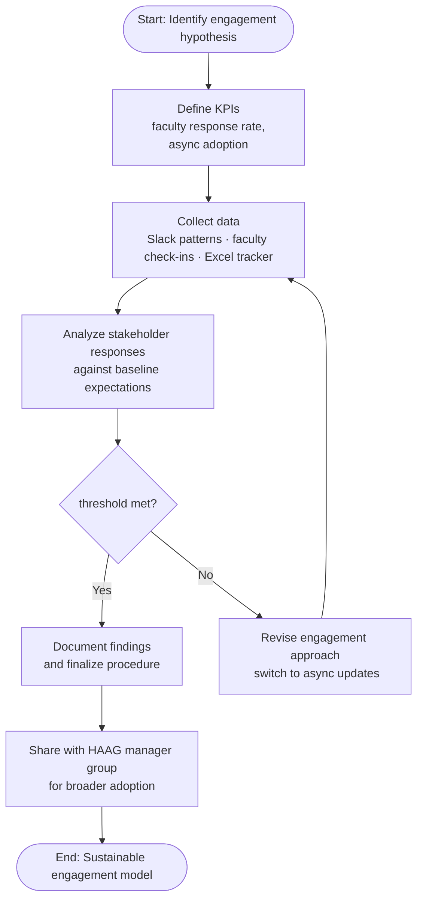

# Management & Leadership — Mid-Semester Report

## HAAG — Faculty Relations: Standardized Faculty Engagement Framework

---

## Initiative Questions

### 1. Describe your initiative / procedure.

This initiative designs a Standardized Faculty Engagement and Retention Framework for HAAG. Faculty engagement currently lacks consistent structure — no formal communication schedule, feedback collection method, or documented expectations process exists. The goal is to create a faculty check-in template, feedback survey, and recommended communication schedule to improve consistency and retention.

### 2. Hypotheses / KPIs.

**Hypothesis:** Adopting a standardized engagement procedure (communication schedule, check-in template, feedback survey) will improve faculty retention and reduce communication gaps.

**Measured so far:** Baseline retention rate established via master Excel sheet comparison; Slack communication patterns observed; direct faculty conversations initiated.

**Still to measure:** Faculty satisfaction scores, clarity of expectations, communication consistency, and pilot vs. control group comparison after the mid-semester survey.

### 3. Method for testing (flowchart description).

### 4. Stakeholder engagement.

Primary stakeholders: HAAG managers/PMs, admin, team leads, and faculty sponsors. Faculty have been receptive during discovery. Broader admin/manager engagement is still developing and will need increased outreach before the pilot phase.

### 5. Documentation for sustainability.

**Completed:** Draft check-in template, communication schedule outline, survey design, baseline retention data.

**Planned:** Finalized engagement procedure manual, pilot results report, and revised templates — all to be hosted on the team's shared repository.

### 6. Measuring progress.

Progress tracked by framework stage completion. Positive indicators include faculty willingness to participate and positive reception to structured communication. Key challenge: measuring long-term retention within a single semester and ensuring adequate pilot/control group sizes.

### 7. Obstacles / bottlenecks.

**Anticipated:** Time constraint — full semester needed for retention outcomes, so proxy metrics (satisfaction, consistency) are used.

**Unexpected:** Faculty preferences vary (Slack vs. email vs. less frequent contact), requiring flexibility in the standardized schedule while maintaining a minimum baseline.
